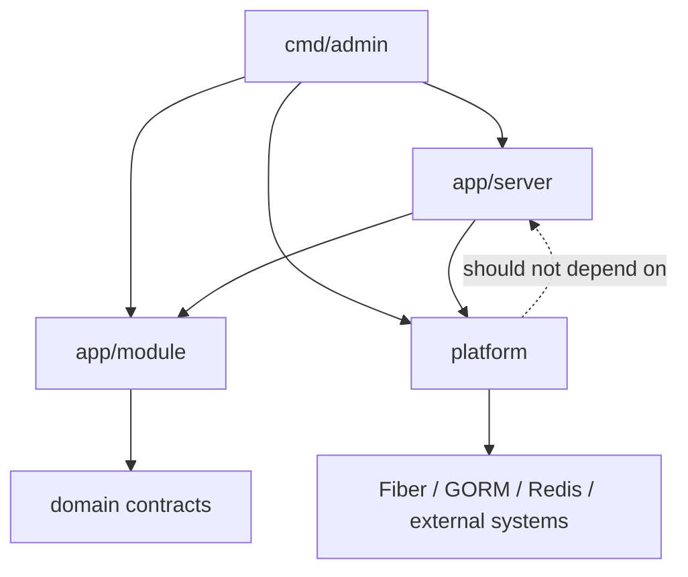

# Project Architecture

Use this skill when deciding where code belongs. Read [application layers](./references/application-layers.md) for the affected boundary.

## Singular Dependency Direction

Treat package dependencies as a one-way graph. A package may depend on a lower-level package, but lower-level packages must not reach back into their callers. In particular, `internal/app/module` must not import `internal/app/server`, and `internal/platform` must not import application packages.

When a framework-specific adapter needs a module dependency, resolve or construct it in `app/server` and pass it explicitly into the adapter. Do not make the module retrieve it from Fiber state, a global registry, or a server service package.

## Boundaries

- `cmd/admin` boots the application and composes dependencies.
- `internal/app/server/router` owns HTTP route registration and page/API handlers.
- `internal/app/server/ui` owns reusable templui components, layouts, embedded assets, and browser-facing scripts.
- `internal/app/server/middleware` and `internal/app/server/service` own application-specific Fiber adapters and lifecycle services.
- `internal/app/module` owns business concerns such as auth, RBAC, localization, models, and DAO access.
- `internal/platform/http/fiber` owns neutral Fiber integration helpers and HTMX request utilities.
- `internal/platform` owns neutral infrastructure adapters such as configuration, GORM database setup, and Redis client setup.
- `scripts` owns migrations and development seed workflows.

Keep dependency direction moving from composition and delivery code toward modules, domain contracts, and external infrastructure. Reuse existing render, middleware, and service boundaries before adding new ones. If a proposed import points from `module` or `platform` back to `server`, stop and move the adapter or change the API to accept an explicit dependency.