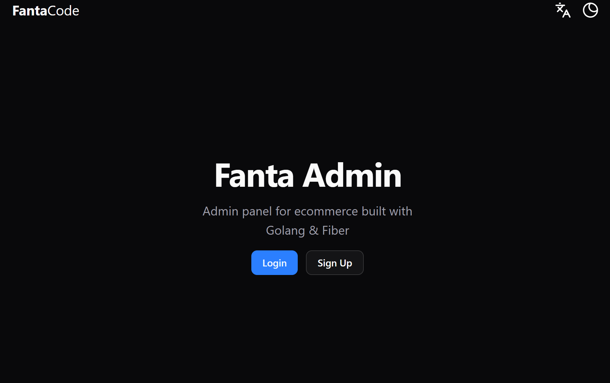
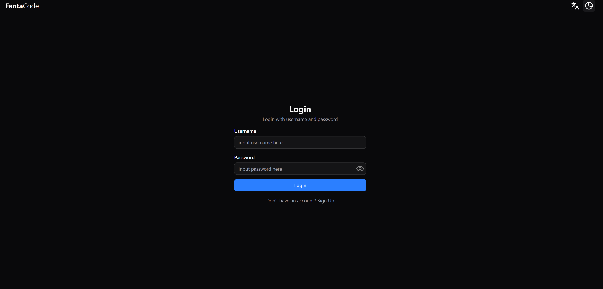
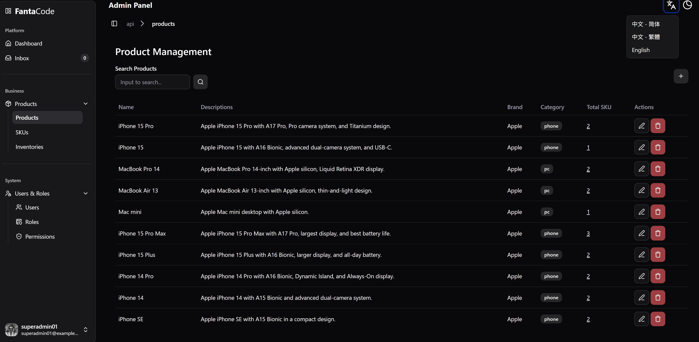
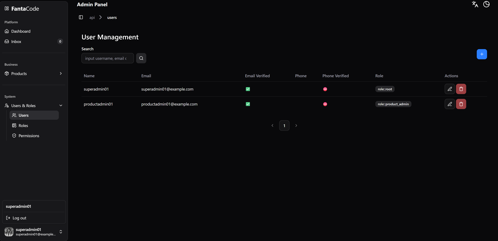

# Go Simple Admin Template

<p align="center">
  <a href="./README.md">English</a> |
  <a href="./README_CN.md">简体中文</a> |
  <a href="./README_ZH.md">繁體中文</a> |
  <a href="./README_KR.md">한국어</a> |
  <a href="./README_JP.md">日本語</a> |
  <a href="./README_VN.md">Tiếng Việt</a> |
  <a href="./README_SP.md">Español</a> |
  <a href="./README_xx.md">العربية</a>
</p>

<p align="center">
  قالب بدء للإدارة وواجهات API مناسب لأسلوب vibe coding وموجّه لفرق Go الخالص.
</p>

<p align="center">
  Templ UI + HTMX + Fiber v3 + GORM + Goose + go-i18n + Swagger
</p>

<p align="center">
  <a href="#المزايا">المزايا</a> |
  <a href="#التقنيات">التقنيات</a> |
  <a href="#طريقة-التشغيل">طريقة التشغيل</a> |
  <a href="#سير-عمل-ai">سير عمل AI</a>
</p>

هذا المستودع هو نقطة بداية لإدارة مبنية بالكامل بـ Go، مخصص للفرق التي تريد صفحات مرسومة من الخادم وواجهات API موثقة وبنية مشروع واضحة، من دون الاعتماد على إطار admin ثقيل.

## المزايا

- الواجهة الأمامية والخلفية كلتاهما بـ Go
- بنية واضحة للمسارات والصفحات والنماذج والترحيلات والترجمات، ما يجعل التوسعة بواسطة AI أسهل
- واجهة بأسلوب ShadCN باستخدام [Templ UI](https://templui.io/)
- أسلوب كتابة مكونات قريب من React داخل Go عبر [`templ`](https://templ.guide/)
- تحديثات جزئية باستخدام [HTMX](https://htmx.org/) من دون React أو Vue
- خادم API موثق عبر Swagger
- أمثلة مدمجة لـ auth و RBAC و i18n و pagination و CRUD
- PostgreSQL + GORM + Goose + سكربتات seed
- لا حاجة إلى Node أو npm أثناء التشغيل

## لماذا هذا المستودع

هذا المشروع يقع في المنتصف بين تطبيقات Go الخام وأطر الإدارة الثقيلة:

- أبسط من بنية Go + Javascript(React/Vue)
- أقل تقييداً من أطر الإدارة المعتمدة على الإعدادات
- متكامل بما يكفي لبناء ميزات الإدارة الشائعة بسرعة
- مرن بما يكفي للاستمرار في كتابة Go بشكل طبيعي

## التقنيات

- Frontend: [Templ UI](https://templui.io/) + [HTMX](https://htmx.org/)
- Web: [Fiber v3](https://docs.gofiber.io/)
- Auth: [pkgz/auth](https://github.com/go-pkgz/auth)
- RBAC: [casbin](https://casbin.apache.org/)
- DB: PostgreSQL 18 + [GORM](https://gorm.io/cli/) + [goose](https://pressly.github.io/goose/)
- i18n: [go-i18n](https://github.com/nicksnyder/go-i18n)
- OpenAPI: [swaggo](https://github.com/swaggo/swag)

## ما الذي يتضمنه

- صفحات auth
- dashboard و inbox
- إدارة المنتجات و SKU والمخزون
- إدارة المستخدمين والأدوار والصلاحيات
- ترجمات للإنجليزية والصينية المبسطة والصينية التقليدية
- تخطيط admin ومكونات UI قابلة لإعادة الاستخدام
- مسار migration و seed
- Swagger UI

## لقطات الشاشة

| | | | |
|---|---|---|---|
| [](./screenshots/homescreen.png) | [](./screenshots/login.png) | [](./screenshots/product-list.png) | [](./screenshots/user-management.png) |
| Home Screen | Login | Products | Users |

## طريقة التشغيل

أسرع طريقة:

```sh
docker compose up --build
```

- التطبيق: `http://localhost:3000`
- Swagger UI: `http://localhost:3000/openapi/swagger`
- تسجيل دخول التطوير: `superadmin01` / `password01`

سيقوم Docker Compose بتشغيل Postgres وتنفيذ migration و seed ثم تشغيل التطبيق.

للتطوير المحلي استخدم مهمة VS Code باسم `dev`.

المهام المفيدة:

- `templ gen`
- `Goose Up`
- `Goose Down`
- `Goose Status`
- `GORM Seed`

## سير عمل AI

- ابدأ من [llm.md](./llm.md)
- استخدم الوثائق داخل `skills/` للمهام الشائعة
- دع AI يعدل ملفات المصدر ثم أعد توليد templ أو GORM أو Swagger عند الحاجة
- اتبع الوحدات الموجودة بدلاً من ابتكار أنماط جديدة

## API + UI

هذا المشروع هو في الوقت نفسه:

- خادم UI للإدارة
- خادم API موثق

المسارات موجودة تحت `internal/admsvr/router` ويتم تقديم Swagger من `/openapi/*`.