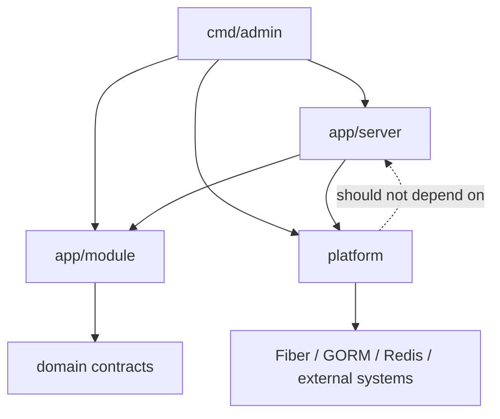

# LLM Guide

This repository is a pure Go admin and API starter. Treat it like a normal Fiber application with server-rendered `templ` pages, not like a meta-framework.

## Core Intent

- Keep implementation close to plain Go.
- Use existing feature modules as the source of truth for patterns.
- Prefer adding code in the same style and folder layout that already exists.
- Avoid introducing extra abstraction unless the repo already uses it.

## Mental Model

- `cmd/admin/main.go` boots the app and wires dependencies.
- `internal/app/server/router` holds the HTTP entrypoints.
- `internal/app/server/router/api` holds authenticated admin modules under `/api`.
- `internal/app/server/router/auth` holds login and signup flows.
- `internal/app/ui` holds reusable UI building blocks.
- `internal/app/module` holds business concerns such as auth, RBAC, i18n, DAO, and models.
- `internal/app/server/middleware` and `internal/app/server/service` hold application-specific Fiber adapters and lifecycle services.
- `internal/platform` holds neutral infrastructure adapters; `internal/platform/http/fiber` holds neutral Fiber and HTMX helpers.
- `scripts/goose` and `scripts/seed` hold migration and seed workflows.

## Singular Dependency Direction

Dependencies follow one direction through the application. Delivery and composition code may depend on business modules and platform adapters; those lower layers must not import their callers or retrieve application dependencies from server state.

This project practices the rule by keeping Fiber-specific localization and RBAC middleware under `internal/app/server/middleware`, where the server passes an i18n bundle or Casbin enforcer explicitly. Business packages under `internal/app/module` contain the authorization and localization concepts but do not import the Fiber service registry. Neutral adapters remain under `internal/platform`.

## Non-Negotiable Working Rules

- Do not invent a new framework layer.
- Do not add an `admin resource` DSL.
- Do not hand-edit generated `*_templ.go` files.
- Do not hand-edit generated files under `internal/app/module/dao/gen`.
- Regenerate code from source files when needed.
- Reuse existing middleware and render helpers before creating new ones.
- Keep HTML pages and JSON/data handlers close to the relevant feature module.

## Preferred Workflow Before Changing Code

1. Read the existing module that is closest to the new task.
2. Identify which layer is being changed: route, templ page, translation, model, migration, or seed.
3. Change the source files only.
4. Run the relevant generator if the repo expects generated output.
5. Validate the route, data flow, and localization behavior.

## Repo Conventions To Preserve

- New admin routes normally belong under `internal/app/server/router/api/<feature>`.
- Route modules expose `New(i do.Injector) fiber.Router` and are mounted from a parent index file.
- HTML rendering goes through `internal/platform/http/fiber/handler.RenderTempl`.
- Server middleware and Fiber lifecycle services belong under `internal/app/server`, not in business modules or neutral platform packages.
- Layout composition happens by passing layout components into `RenderTempl`.
- Localization comes from the request-scoped localizer stored in Fiber locals.
- Models live under `internal/app/module/dao/model`.
- Future schema changes should be added as new Goose migrations.

## Generation Commands

- Templ: `go tool templ generate`
- GORM model generation: `go generate ./internal/app/module/dao/model`
- Swagger docs: `go generate ./internal/app/server/router`

Use the existing VS Code tasks when they already exist.

## Skills

For more information, read the broader topics and guidance under `.agent/skills`; these materials are not limited to executable skills.

- [Agent skills index](./.agent/skills/index.md)
- [Coding style](./.agent/skills/coding-style/SKILL.md)
- [Development flow](./.agent/skills/dev-flow/SKILL.md)
- [Project architecture](./.agent/skills/project-architecture/SKILL.md)
- [Frontend stack](./.agent/skills/frontend-stack/SKILL.md)

## Good Defaults For AI

- Copy the closest existing feature module instead of creating a novel structure.
- Keep handlers small and explicit.
- Prefer composable templ components over one giant page component.
- If a page can serve both full-page and HTMX partial responses, follow the existing product module pattern.
- If an API shape changes, keep Swagger annotations in sync.

## What This Repo Is Not

- Not a low-code admin framework.
- Not a config-driven CRUD generator.
- Not a frontend SPA with Go acting only as an API.

It is a clean Go codebase that already includes the boring pieces so AI can help you extend real product features faster.